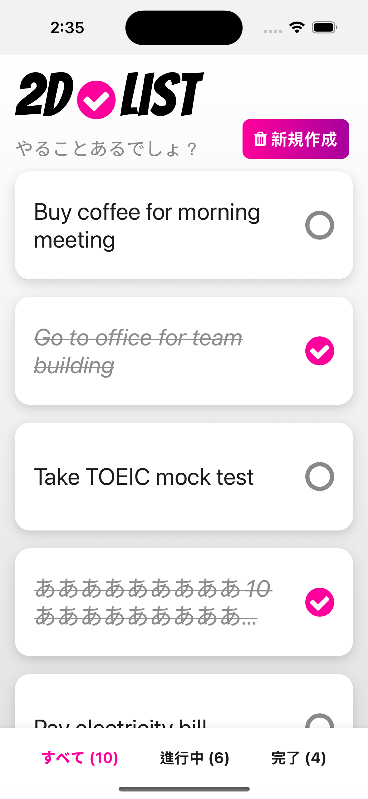
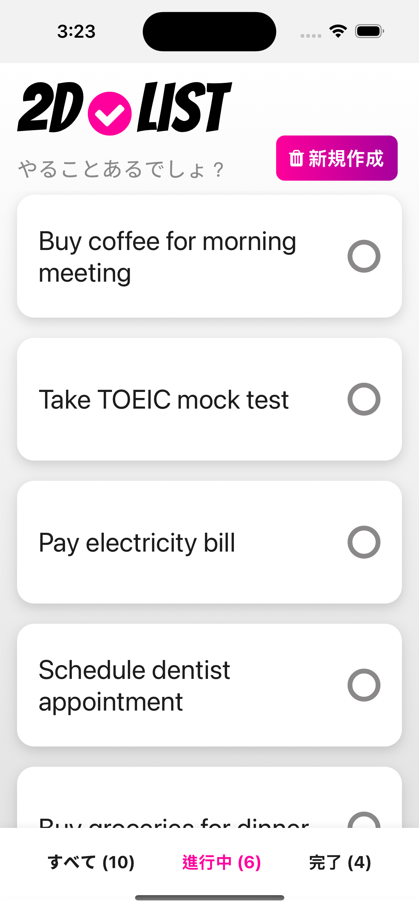
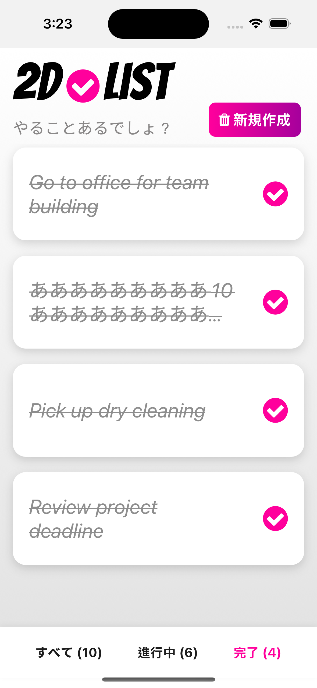
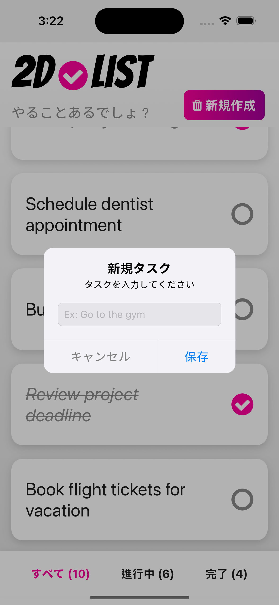
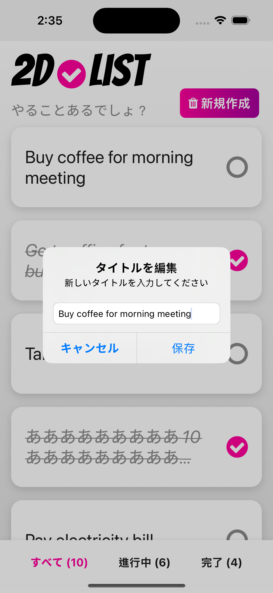
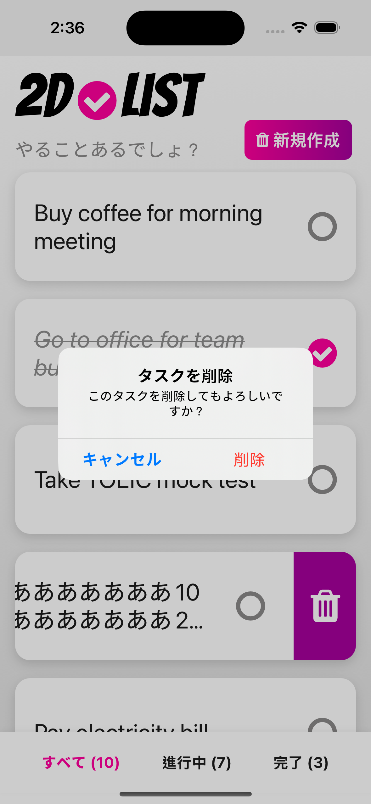

<div align="center">
  
  <h1>Swipeable To-Do App</h1>
</div>


A modern, gesture-driven Todo application built with React Native and Expo. Users can manage tasks with intuitive swipe gestures, track completion status, and organize todos through a tab-based interface.

# User Stories

### Authentication
- As a user, I see a lock screen on app launch
  - Use Passcode to unlock the app
  - Use fallback password (`1234`) as last resort
  - Smooth transition to main app

### Task Management
- As a user, I can add a new todo task by:
  - Clicking the "新規作成" button
  - Entering task title in the dialog
  - Confirming with "保存" button

### Task Interactions
- As a user, I can mark a todo as complete/incomplete by:
  - Tapping the circle checkbox icon
  - Seeing it change from empty circle to filled checkmark
  - Watching the text become strikethrough and italic

### Gesture Controls
- As a user, I can delete a todo by:
  - Swiping left on any task
  - Revealing the delete button with trashcan icon
  - Confirming deletion in dialog

### Task Editing
- As a user, I can edit a todo title by:
  - Long pressing on any task
  - Updating text in prompt dialog
  - Saving changes with "保存" button

### Task Visualization
- As a user, I can view my todos:
  - In a scrollable list
  - Grouped by completion status

# App Details

## Screenshots

| All Tasks | In Progress | Completed |
|:-:|:-:|:-:|
|  |  |  |
| **Add New Task** | **Edit Task** | **Delete Task** |
|  |  |  |

### Screen Details
- **All Tasks**: Main view showing all todo items
- **In Progress**: Filtered view of uncompleted tasks
- **Completed**: Filtered view of completed tasks
- **Add Task**: Dialog for adding new tasks
- **Edit Task**: Dialog for editing existing tasks
- **Delete Task**: Swipe gesture and confirmation dialog


## Get started

1. Install dependencies

   ```bash
   npm install
   ```

2. Start the app

   ```bash
   npx expo start
   ```

## Run tests

```bash
# Run all tests
npm test

# Run specific test file
npm test TabBottomMenu
```

